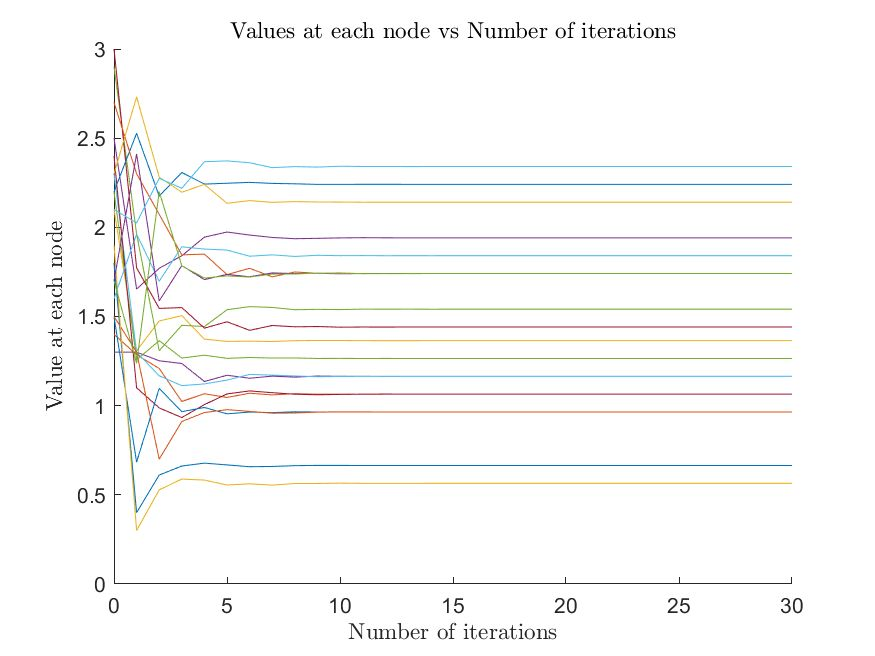
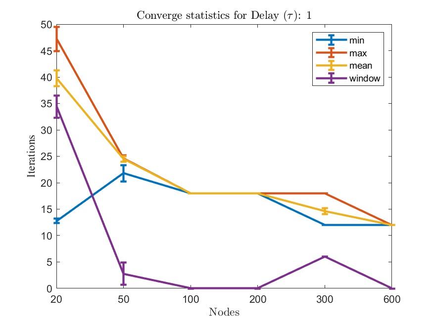

# Federated Capacity Ratio Consensus

In this work, we propose a federated, asynchronous, and iterative scheme which allows a set of interconnected nodes 
to reach an agreement (consensus) within a pre-specified bound in a finite number of steps. While this scheme could be 
adopted in a wide variety of applications, we discuss it within the context of task scheduling for data centers. For the 
context of this work, the algorithm is guaranteed to *approximately* converge to the optimal scheduling plan, given the 
available resources, in a **finite** number of steps; and is guaranteed to terminate at the same time for all nodes. 
Furthermore, being asynchronous, the proposed scheme is able to take into account the uncertainty that can be introduced 
from straggler nodes or communication issues in the form of latency while still converging to the target objective. In
addition, by using extensive empirical evaluation through simulations we show that the proposed method exhibits 
state-of-the-art performance.

# Requirements

The code is generally self-contained and all datasets are generated thus, in theory, just having `Matlab`  
installed should be more than enough. It has to be noted though that due the recent `Matlab` changes on how it handles 
character and string arrays you should use a recent version of it. The actual code was developed and tested in `R2021a` 
(build `9.10.0.1684407`) but was tested also on versions `2019{a,b}` and `2020{a,b}`. Moreover, to address different OSes, 
care has been taken so that this code runs without any problems both on Windows-based machines and Unix-based ones.

# Evaluation

The evaluation can be split into two main components; namely:

 1. verification of the algorithmic scheme,
 2. quantify its performance across various configurations.
 
## Algorithmic evaluation

To elaborate on the algorithmic evaluation, we need to define what our configuration is; we define a parameter tuple as the 
number of distinct elements that change per run. In this instance, we vary the network size (its nodes `Ν`) and their expected 
latency range (the delays `τ`).

### Capacity consensus

This is a rudimentary scheme which is *synchronous* and does not tolerate *any delays* between the node communication; we can
see from the graph below, that in ideal circumstances, can converge with few iterations given the network size.

<!-- capacity consensus example run -->
<p align="center"">
  
</p>

However due to both delays and synchronization being commonplace in real-world networks this seems impractical for 
real-world usage. To overcome its shortcomings, we introduce another concept - the capacity ratio consensus.

### Capacity ratio consensus with finite termination

Resource allocation in data centers gives rise to large-scale problems and networks, which naturally call for 
asynchronous solutions. Subject to the diameter of the network being known we propose an algorithm that is 
asynchronous and is guaranteed to complete in multiples of `τD`, where `τ` is the max network delay and D its 
diameter. Our scheme is based on the ratio-consensus protocol and takes advantage of `min - max`-consensus 
iterations to allow the nodes to determine the time step when their ratios are within `ε` of each other, 
where `ε` is a small constant. 

We evaluate our proposed scheme against varying network sizes of: `N = [20, 50, 100, 200, 300, 600]` and 
varying network delays of: `τ = [1, 5, 10, 15, 20, 30]`. We run the algorithm over 10 trials for each of 
the parameter tuple as defined previously and aggregate over the results. An example of such a network 
run is shown below,

<!-- federated capacity ratio consensus example run -->
<p align="center"">
  
</p>

We see that the nodes successfully converge within epsilon in multiples of `τD`. Now we introduce the aggregate 
converge statistics, which are the following,

 - `min`: the min iteration at which a node converged,
 - `max`: the max iteration at which a node converged (but not flipped),
 - `mean`: the average node converge iteration,
 - `window`: the window is defined as the difference between the `max - min` showing how long it takes from the first node converging to all nodes converging as well.
 
Below we present the aggregate converge statistics when the network has small delay (`τ = 1`),

<!-- federated capacity ratio consensus example run -->
<p align="center"">
  
</p>
                                                                                                      
Now, we see how the aggregate converge statistics behave in the presence of high delay (`τ = 30`),                                                                                                      
<!-- federated capacity ratio consensus example run -->
<p align="center"">
  
</p>

Notably, as delay increases the converge iterations increase as well; however, interestingly, the window of 
min/max time that nodes converge becomes zero as the network size increases.
                                                                                                       
                                                                                              
Further, another concept that is worth mentioning is the concept of node "flips". Concretely, this is defined 
when a node has seemingly converged then a new measurement arrives that results into that particular node 
violating the constraint and thus this node becoming divergent again. The aggregate flip statistics over all 
delays are shown in the graph below,

<!-- federated capacity ratio consensus example run -->
<p align="center"">
  
</p>   

### Data center scale evaluation

Finally, as stated in the paper we performed large scale experiments with particular configurations catered towards modem 
data centers, containing thousands of nodes. These assume that the network size can be thousands of nodes 
(we test up to 10k), have low delays (we test up to 5), and the graph diameter is assumed to be small (i.e.: less than 5). 
To run these experiments, please see the comments on how to tweak the test parameters in order to execute it.
Please beware that it requires a considerable amount of RAM to run; concretely, in my machine it required more than 63GB 
of available memory to successfully complete.                                                                                         
                                                                                              

# Running the evaluation scripts

Running the test scripts is fairly simple -- just `cd` to the cloned `federated_ratio_consensus` directory within `Matlab` and then run the respective test files - brief explanation of what they do is shown below:

 * [`capacity_consensus_basic.m`](capacity_consensus_basic.m): our baseline capacity consensus algorithm.
 * [`federated_ratio_consensus.m`](federated_ratio_consensus.m): our benchmark for the federated capacity ratio consensus algorithm - see comments on how to configure for regular or data-center evaluation.
 
# Code Organisation

The code is self-contained and a brief explanation of what each file does follows. The 
files are ordered in (descending) lexicographical order:
 * [`capacity_consensus_basic.m`](capacity_consensus_basic.m): our baseline for the capacity consensus algorithm.
 * [`federated_ratio_consensus.m`](federated_ratio_consensus.m): Used to benchmark the delay tolerant capacity ratio consensus.
 * [`gen_graph.m`](gen_graph.m): Implements a random graph generation route based on provided parameters.
 * [`gen_state_matrix.m`](gen_state_matrix.m): Generates the state matrix that simulates the delays between the nodes within the network.
 * [`gen_utilisation.m`](gen_utilisation.m): Generates the utilization vector based on min/max and a distribution.
 * [`gen_workload.m`](gen_workload.m): Generates the workload vector to be used in the benchmark.
 * [`interp_delay.m`](interp_delay.m): Interpolates final values if some missing due to delays for plotting nicely.
 * [`print_fig.m`](print_fig.m): Prints figures in different formats (i.e.: `pdf`, `png`, and `fig`).
 * [`README.md`](README.md): This file, a "brief" README file.
 * [`setup_vars.m`](setup_vars.m): sets up the environment variables.
 
Please note that you can tweak the relevant section values if you want to run slightly different experiments but if 
you want to reproduce the results in the paper please use the values specified in the paper (or code comments).

# License

This code is licensed under the terms and conditions of GPLv3 unless otherwise stated. 
The actual paper is governed by a separate license and the paper authors retain their 
respective copyrights.

# Acknowledgement

If you find our paper useful or use this code, please consider citing our work as such:

```
@misc{2101.06139,
Author = {Andreas Grammenos and Themistoklis Charalambous and Evangelia Kalyvianaki},
Title = {CPU Scheduling in Data Centers Using Asynchronous Finite-Time Distributed Coordination Mechanisms},
Year = {2021},
Eprint = {arXiv:2101.06139},
}
```

# Disclaimer

THIS SOFTWARE IS PROVIDED BY THE COPYRIGHT HOLDERS AND CONTRIBUTORS "AS IS" 
AND ANY EXPRESS OR IMPLIED WARRANTIES, INCLUDING, BUT NOT LIMITED TO, THE 
IMPLIED WARRANTIES OF MERCHANTABILITY AND FITNESS FOR A PARTICULAR PURPOSE ARE 
DISCLAIMED. IN NO EVENT SHALL THE COPYRIGHT OWNER OR CONTRIBUTORS BE LIABLE FOR 
ANY DIRECT, INDIRECT, INCIDENTAL, SPECIAL, EXEMPLARY, OR CONSEQUENTIAL DAMAGES 
(INCLUDING, BUT NOT LIMITED TO, PROCUREMENT OF SUBSTITUTE GOODS OR SERVICES; 
LOSS OF USE, DATA, OR PROFITS; OR BUSINESS INTERRUPTION) HOWEVER CAUSED AND 
ON ANY THEORY OF LIABILITY, WHETHER IN CONTRACT, STRICT LIABILITY, OR TORT 
(INCLUDING NEGLIGENCE OR OTHERWISE) ARISING IN ANY WAY OUT OF THE USE OF THIS 
SOFTWARE, EVEN IF ADVISED OF THE POSSIBILITY OF SUCH DAMAGE.
